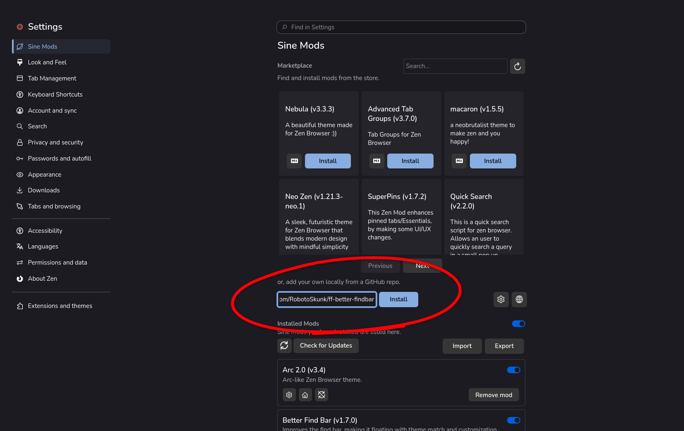
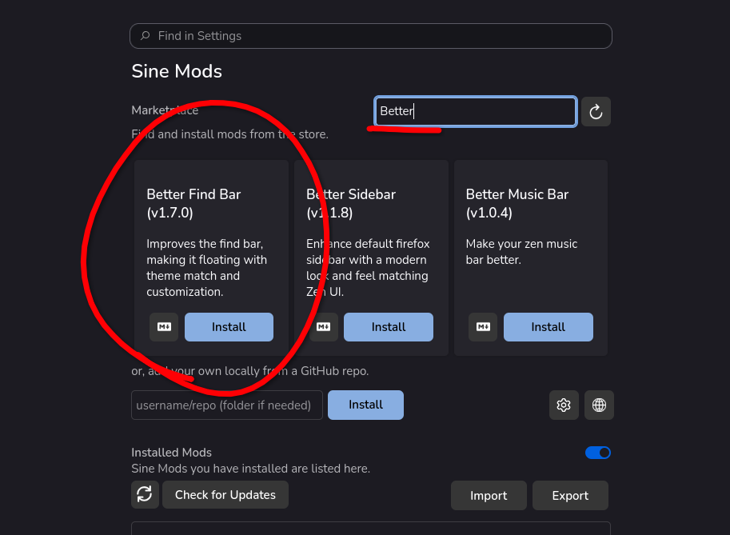

# Better Find Bar

Improves the find bar, making it floating with theme match and customization.


## Installation

> ### ⚠️ NOTICE FOR ZEN USERS ⚠️
> The Zen Store repository has been archived, so I cannot update the mod in the
> Zen Store. It's recommended using the other methods listed below to install
> the mod along with its corresponding patches.

### Install Using Sine (Recommended)
Sine is a community-driven mod/theme manager for all Firefox-based browsers.

#### Method 1 (Recommended)
1. Download the latest stable version of Sine
[from here](https://github.com/CosmoCreeper/Sine/releases) and install it.

2. Copy the repository URL (https://github.com/RobotoSkunk/ff-better-findbar)
and paste it to get the latest updates of the mod.


#### Method 2
> This method does not install the latest mod updates immediately, and updates
> take a couple more days than with the first method.

1. Download the latest stable version of Sine
[from here](https://github.com/CosmoCreeper/Sine/releases) and install it.

2. Search "Better Find Bar" in the marketplace search bar and install it.


#### Manual Installation (Traditional Method)
> This method requires a basic understanding of CSS variables to customize the
> search bar.

1. Go to `about:profiles`, open `Root Directory`, then open or create a
lowercase folder named `chrome`.
2. Download the repository ZIP file.
3. Extract the `userChrome.css` file from the ZIP file into the `chrome` folder.
4. Customize the find bar with the custom preferences listed below.

Firefox preferences
```txt
better_findbar.horizontal_position      -> String (left, center, right)
better_findbar.vertical_position        -> String (top, bottom)
better_findbar.transparent_background   -> Boolean
better_findbar.enable_custom_background -> Boolean
better_findbar.enable_custom_text_color -> Boolean
better_findbar.enable_custom_box_shadow -> Boolean
better_findbar.hide_highlight           -> String (not_hide, hide_immediately, hide_on_disable)
better_findbar.hide_match_case          -> String (not_hide, hide_immediately, hide_on_disable)
better_findbar.hide_match_diacritics    -> String (not_hide, hide_immediately, hide_on_disable)
better_findbar.hide_whole_words         -> String (not_hide, hide_immediately, hide_on_disable)
better_findbar.instant_animations       -> Boolean
better_findbar.hide_find_status         -> Boolean
better_findbar.hide_found_matches       -> Boolean
```

CSS variables
```css
:root {
    --better_findbar-custom_background: #aabbcc;
    --better_findbar-custom_text_color: #112233;
    --better_findbar-custom_box_shadow: 0 5px 10px rgba(0, 0, 0, 0.5);
}
```
